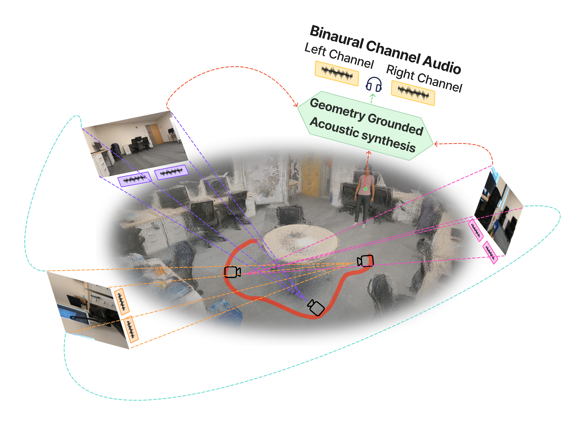

# Visual Geometry Grounded Novel-View Acoustic Synthesis

**CVPR 2026 Workshop**

Jay Polra · Dhwanil Chauhan · Wenjun Huang · Kyle Toth · Xianhui Wang · Yang Ni

*Purdue University Northwest · UC Irvine · CIVS · San Diego State University*

<p align="center">
  <a href="https://dhwanil832.github.io/nvas/">
    
  </a>
</p>


---

> **Abstract:** We present the first unified framework for novel-view acoustic synthesis that entirely bypasses explicit 3D visual rendering and costly photogrammetry by directly grounding spatial audio generation in feed-forward visual geometry. Our method synthesizes accurate and immersive binaural audio in 3D spaces without requiring viewpoint images, dense point maps, or any ground-truth poses for input video.



---

## Results

| Dataset | # Params | FPS | MAG ↓ | ENV ↓ | LRE ↓ | DPAM ↓ |
|---------|----------|-----|-------|-------|-------|--------|
| RWAVS | 3.24M | 189 | 0.3485 | 0.1424 | 0.9589 | 0.2705 |
| Replay-NVAS | 3.24M | 398 | 0.1590 | 0.0400 | 0.8060 | 0.2240 |

---

## Repository Structure

```
GGAD/
├── configs/                    # Dataset-specific training configs
│   ├── default.py              # Base config with all defaults
│   ├── rwavs.yaml              # RWAVS dataset config
│   └── replaynvas.yaml         # Replay-NVAS dataset config
│
├── libs/                       # Core library
│   ├── models/
│   │   ├── ggad.py             # GGAD model (Geometry-Grounded Acoustic Decoder)
│   │   └── networks/           # Transformer, encoder, MLP components
│   ├── datasets/
│   │   ├── rwavs.py            # RWAVS dataset loader
│   │   ├── replay_nvas.py      # Replay-NVAS dataset loader
│   │   └── scene/              # Scene geometry utilities
│   ├── trainers/
│   │   └── AVTrainer.py        # Training loop
│   ├── criterions/
│   │   └── Criterion.py        # Multi-resolution STFT loss
│   ├── evaluators/
│   │   └── gen_eval.py         # Evaluation metrics (MAG, ENV, LRE, DPAM)
│   └── utils/                  # Camera, LR scheduler, misc utilities
│
├── tools/                      # Training and evaluation entry points
│   ├── train.py                # Main training script
│   ├── test_rwavs.py           # RWAVS evaluation
│   ├── test_replaynvas.py      # Replay-NVAS evaluation
│   ├── aggregate_vggt_results.py  # Aggregate metrics across scenes
│   └── benchmark_fps.py        # FPS benchmarking
│
├── feature_extraction/         # Pre-processing (run once before training)
│   ├── rwavs/
│   │   ├── extract_vggt_features.py   # Extract VGGT visual tokens
│   │   └── cache_mid_signal.py        # Cache acoustic prototype signals
│   └── replaynavs/
│       ├── extract_context.py         # Extract VGGT context features
│       ├── extract_targets.py         # Extract target frame poses
│       └── cache_mid_signal.py        # Cache acoustic prototype signals
│
├── scripts/                    # Shell scripts to run full pipelines
│   ├── train_rwavs.sh
│   └── train_replaynvas.sh
│
└── visualisation/              # Analysis and plotting scripts
```

---

## Setup

### 1. Clone the Repository

```bash
git clone https://github.com/<your-username>/GGAD.git
cd GGAD
```

### 2. Create Environment

```bash
conda create -n ggad python=3.10
conda activate ggad
```

### 3. Install Dependencies

```bash
pip install torch torchvision torchaudio --index-url https://download.pytorch.org/whl/cu118
pip install -r requirements.txt
```

---

## Datasets

### RWAVS

Download the RWAVS dataset from the [official release](https://github.com/yoyomimi/AV-Cloud) and place it at:
```
RWAVS/release/
```
The expected structure is:
```
RWAVS/release/
├── scene_1/
│   ├── transforms_train.json
│   ├── transforms_val.json
│   ├── audio/
│   └── images/
├── scene_2/
...
└── scene_13/
```

### Replay-NVAS

Download the Replay-NVAS v3 dataset and place it at:
```
ReplayNVAS/v3/
```
The expected structure is:
```
ReplayNVAS/v3/
├── metadata_v4.json
├── SC-1022/
├── SC-1023/
...
```

---

## Feature Extraction (Run Once)

Feature extraction pre-computes VGGT visual tokens and acoustic prototype signals. This only needs to be run **once** per dataset.

### RWAVS

```bash
# Step 1 — Extract VGGT visual tokens for all 13 scenes
python feature_extraction/rwavs/extract_vggt_features.py

# Step 2 — Cache acoustic prototype signals
python feature_extraction/rwavs/cache_mid_signal.py
```

Outputs are saved to `RWAVS/vggt_outputs_v3/` (one folder per scene containing `features.pth`, `selection.json`, `mid_signal_cache.json`).

### Replay-NVAS

```bash
# Step 1 — Extract VGGT context features
python feature_extraction/replaynavs/extract_context.py

# Step 2 — Extract target frame poses
python feature_extraction/replaynavs/extract_targets.py

# Step 3 — Cache acoustic prototype signals
python feature_extraction/replaynavs/cache_mid_signal.py
```

Outputs are saved to `ReplayNVAS/replaynavs_outputs_256/`.

---

## Training

### RWAVS

RWAVS trains one scene-specific model per scene (13 scenes total). Use the provided shell script to run scenes in sequence or in parallel across GPUs.

```bash
# Train all 13 scenes on GPU 0
./scripts/train_rwavs.sh 0 1 13

# Or split across two GPUs in parallel
./scripts/train_rwavs.sh 0 1 7  &
./scripts/train_rwavs.sh 1 8 13
```

Alternatively, run training and evaluation manually for a single scene:

```bash
# Train scene 1
CUDA_VISIBLE_DEVICES=0 python -W ignore tools/train.py \
    --cfg configs/rwavs.yaml \
    output_dir rwavs_scene_1 \
    dataset.video _1

# Evaluate scene 1
CUDA_VISIBLE_DEVICES=0 python -W ignore tools/test_rwavs.py \
    --cfg configs/rwavs.yaml \
    --split val \
    output_dir rwavs_scene_1 \
    dataset.video _1 \
    model.resume_path logs/rwavs_scene_1/rwavs_scene_1/100.pth
```

### Replay-NVAS

Replay-NVAS trains a single model across all scenes jointly.

```bash
# Train and evaluate on GPU 0
./scripts/train_replaynvas.sh 0
```

Or manually:

```bash
# Train
CUDA_VISIBLE_DEVICES=0 python -W ignore tools/train.py \
    --cfg configs/replaynvas.yaml \
    output_dir replaynvas_experiment

# Evaluate on test split
CUDA_VISIBLE_DEVICES=0 python -W ignore tools/test_replaynvas.py \
    --cfg configs/replaynvas.yaml \
    --split test \
    output_dir replaynvas_experiment \
    model.resume_path logs/replaynvas_experiment/replaynvas_experiment/100.pth
```

---

## Evaluation

### Aggregate RWAVS Results (All 13 Scenes)

After evaluating all scenes, aggregate metrics across environments:

```bash
python tools/aggregate_vggt_results.py --prefix rwavs_scene --split val
```

This prints per-environment and overall averages for MAG, ENV, LRE, and DPAM.

### FPS Benchmarking

```bash
CUDA_VISIBLE_DEVICES=0 python tools/benchmark_fps.py --cfg configs/rwavs.yaml
```

---

## Pretrained Checkpoints

| Dataset | Config | Download |
|---------|--------|----------|
| RWAVS (13 scenes) | `configs/rwavs.yaml` | *Coming soon* |
| Replay-NVAS | `configs/replaynvas.yaml` | *Coming soon* |

To evaluate with a pretrained checkpoint:

```bash
# RWAVS — scene 1
CUDA_VISIBLE_DEVICES=0 python -W ignore tools/test_rwavs.py \
    --cfg configs/rwavs.yaml \
    --split val \
    output_dir rwavs_scene_1 \
    dataset.video _1 \
    model.resume_path /path/to/checkpoint.pth
```

---

## Key Config Options

All training behaviour is controlled through YAML configs. The most commonly adjusted parameters:

| Parameter | Location | Description |
|-----------|----------|-------------|
| `dataset.sr` | yaml | Audio sample rate (22050 for RWAVS, 16000 for Replay-NVAS) |
| `model.pose_dim` | yaml | Target pose dimension (12 for RWAVS, 9 for Replay-NVAS) |
| `model.joint_emb_dim` | yaml | Transformer hidden dimension (default: 256) |
| `dataset.N_points` | yaml | Number of reference context frames (default: 256) |
| `train.lr` | yaml | Learning rate (default: 5e-4) |
| `train.max_epoch` | yaml | Training epochs (default: 100) |
| `train.valiter_interval` | yaml | Validation frequency in iterations (default: 50) |

---

## Citation

If you find this work useful, please cite:

```bibtex
@inproceedings{polra2026ggad,
  title     = {Visual Geometry Grounded Novel-View Acoustic Synthesis},
  author    = {Polra, Jay and Chauhan, Dhwanil and Huang, Wenjun and Toth, Kyle and Wang, Xianhui and Ni, Yang},
  booktitle = {CVPR Workshops},
  year      = {2026}
}
```

---

## Acknowledgements

This work is supported by the Steel Manufacturing Simulation and Visualization Consortium (SMSVC).

This codebase builds on [AV-Cloud](https://github.com/yoyomimi/AV-Cloud) and uses [VGGT](https://github.com/facebookresearch/vggt) for feed-forward visual geometry encoding.
